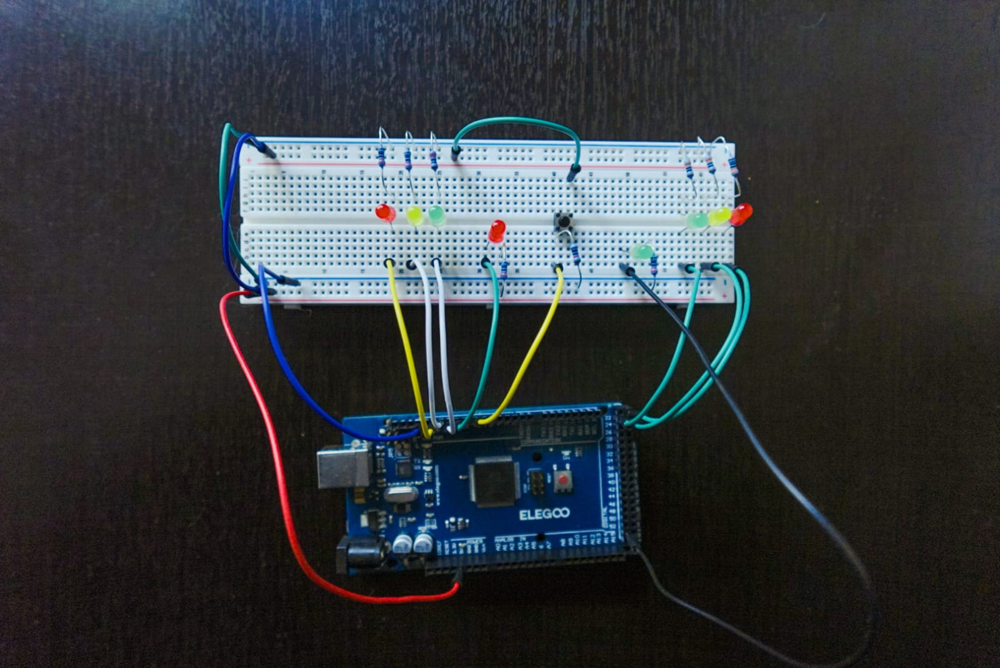

# 🚦 Smart Traffic Intersection with Pedestrian Button

## 🎯 Objective

This project simulates a two-way smart traffic intersection using Arduino Mega. Each road has its own three-light traffic signal, and there’s a dedicated **pedestrian crosswalk system** controlled by a push button. The system follows coordinated state transitions with proper delays and pedestrian logic.

---

## 🧱 Components Used

| Component        | Purpose                                  |
|------------------|------------------------------------------|
| 6 LEDs           | Traffic lights for Street A and Street B |
| 2 LEDs           | Pedestrian signal (Red & Green)          |
| 1 Push Button    | Triggers pedestrian crossing phase       |
| 9 Resistors      | Current limiting for LEDs and button     |
| Arduino Mega     | Controls the logic and timing            |
| Breadboard       | Circuit assembly                         |
| Jumper Wires     | Connections between components           |

---

## 🔄 System Phases and Logic

### Normal Cycle (without pedestrian input):

1. **Street B green** (Street A red) for 8s
2. **Street B yellow** for 3s
3. **1-second safety delay**
4. **Street A green** (Street B red) for 8s
5. **Street A yellow** for 3s
6. **1-second safety delay**
7. Loop restarts

### With Pedestrian Button (or auto-cycle):

- The pedestrian button is monitored continuously via `digitalRead()`
- If the button is pressed during the traffic cycle:
  - The current traffic phase is allowed to complete
  - Then both vehicle signals switch to RED
  - The pedestrian GREEN light is activated for 7 seconds
- ✅ If **no button is pressed for 3 full traffic cycles**, the pedestrian crossing phase is **automatically triggered**
- After crossing time, the system resumes from the correct traffic phase

---

### Code Logic Overview
- Each cycle is tracked using the `trafficCicle` variable
- When `trafficCicle == 3`, a pedestrian crossing phase is forced
- Even if the button was not pressed, the pedestrian light turns green for safety
- This prevents pedestrian starvation or neglect in continuous traffic flow

---

## 📸 Real Circuit

📝 Highlights:
- Left 3 LEDs = Traffic Light A (Red, Yellow, Green)
- Right 3 LEDs = Traffic Light B
- Bottom-right 2 LEDs = Pedestrian Signal
- Button = Center position, diagonally wired
- Each LED and the button have current-limiting resistors

---

## 📄 Source Code

Filename: `smart_intersection.ino`

### Key Sections:
- **Pin configuration** for 8 LEDs and the button
- **Initial state setup** in `setup()`
- **State-based phase logic** in `loop()` using `millis()`
- **Pedestrian button detection** with `digitalRead()`
- **Non-blocking timing** for all transitions

---

## ⏱️ Estimated Development Time

| Task                 | Time     |
|----------------------|----------|
| Circuit Design       | 15 min   |
| Physical Assembly    | 45 min   |
| Programming          | 1 hr     |
| Debugging / Testing  | 1 hr     |
| Documentation        | 1 hr     |
| **Total**            | **~4 hr**|

---

## 🚀 Future Improvements

- Buzzer for auditory pedestrian signal
- LED countdown or blinking phase
- Button cooldown period (e.g. once every 30 seconds)
- Night mode: blinking yellow when ambient light is low

---

## 🧠 Concepts Practiced

- `millis()` vs `delay()` for real-time control
- State machine design using `stateLight` and `trafficCicle`
- Digital input handling with button logic
- Phase coordination and 1s safety delay
- Circuit protection (resistors and clear wiring)

---

## 👨‍💻 Author

**Gabriel Cabrera**  
[@gabrielcabrera446](https://github.com/gabrielcabrera446)  
Engineering Student | Arduino Learning Project
