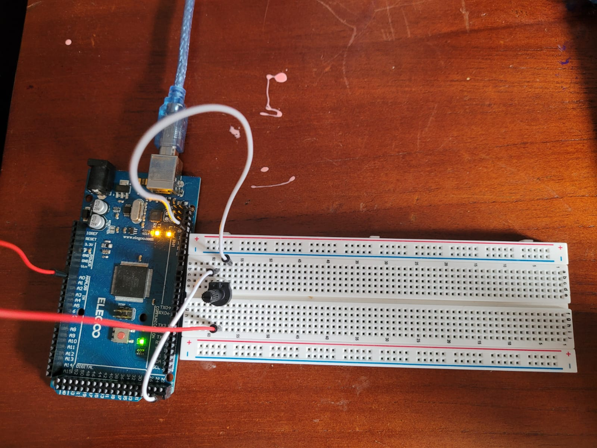

# Analog Potentiometer Reader

## Description
This project reads an analog voltage from a potentiometer and displays both the raw ADC value (0–1023) and the corresponding voltage (0–5V) on the Serial Monitor.

## Components Used
- 10kΩ Potentiometer
- Arduino Mega
- Breadboard and jumper wires

## Circuit


- Left pin of the potentiometer → 5V
- Center pin → A0 (analog input)
- Right pin → GND

## Purpose
To understand how analog signals are read with the Arduino's ADC and how voltages are mapped into digital values.

## Output
Every 500 ms, the Serial Monitor shows output like:
```
Analog: 512  |  Voltage: 2.50 V
```
