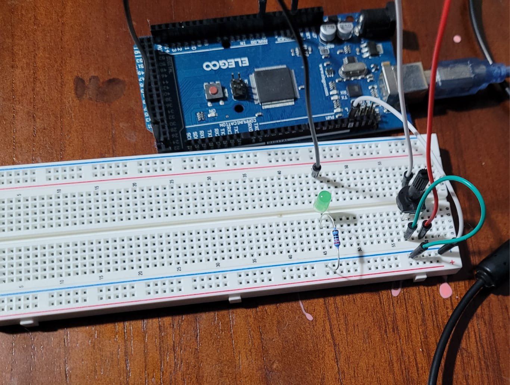

# Phase 2 – Project 2: LED control by threshold with potentiometer

## Description
This project reads an analog value from a potentiometer and turns an LED ON or OFF depending on whether the value is above or below a specified threshold. To improve stability, the code uses:
- Averaging of 16 samples taken every ~5 ms
- Hysteresis with ±2% tolerance around the threshold
- Non-blocking timing with `millis()` for sampling and debug printing
- Printing LED state changes only once per transition

## Components
- Arduino Mega 
- Potentiometer 10kΩ 
- LED 
- Resistor (220Ω) for LED
- Breadboard and jumper wires

## Circuit

- Potentiometer ends: one to 5V, one to GND, wiper (center) to A0
- LED: pin 23 → resistor → LED anode, LED cathode to GND
- Common GND between LED and potentiometer

## Operation
- Threshold base set to 70% of the ADC range (≈716 counts)
- Hysteresis tolerance = ±2% of threshold (≈14 counts)
- LED turns ON above `threshold + tolerance` and OFF below `threshold - tolerance`
- Serial Monitor prints the averaged value and hysteresis limits every 250 ms
- LED status changes are printed only once per transition

## Good Practices Applied
- Avoids `delay()`; uses `millis()` for non-blocking design
- Implements hysteresis to prevent flicker due to signal noise
- Uses averaging to smooth out sensor readings
- Separates debug printing from LED control logic

## Author
Gabriel Cabrera  
Date: 2025-08-13
